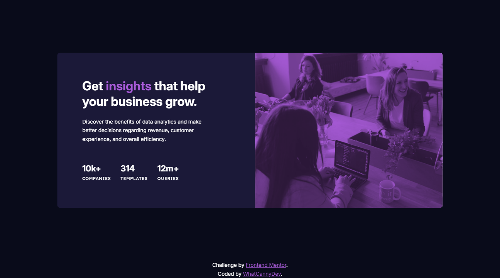

# Frontend Mentor - Stats preview card component solution

This is a solution to the [Stats preview card component challenge on Frontend Mentor](https://www.frontendmentor.io/challenges/stats-preview-card-component-8JqbgoU62). Frontend Mentor challenges help you improve your coding skills by building realistic projects. 

## Table of contents

- [Overview](#overview)
  - [The challenge](#the-challenge)
  - [Screenshot](#screenshot)
  - [Links](#links)
- [My process](#my-process)
  - [Built with](#built-with)
  - [What I learned](#what-i-learned)
  - [Continued development](#continued-development)
  - [Useful resources](#useful-resources)
- [Author](#author)


## Overview

### The challenge

Your challenge is to build out this card component and get it looking as close to the design as possible.

You can use any tools you like to help you complete the challenge. So if you've got something you'd like to practice, feel free to give it a go.

Users should be able to:

- View the optimal layout depending on their device's screen size

### Screenshot




### Links

- Solution Repository URL: [Click here](https://github.com/CannyRo/FrontendMentor_StatsPreviewCardComponent_8JqbgoU62)
- Live Site URL: [Click here](https://cannyro.github.io/FrontendMentor_StatsPreviewCardComponent_8JqbgoU62/)

## My process

### Built with

- HTML5
- CSS custom properties
- Flexbox
- Pseudo-element
- Mobile-first workflow


### What I learned

I learned how to use the “mix-blend-mode” property to mix a color and an image. Here, the main container has a white background-color and a background-image with an original opacity of 0.74. Next, I created a container via a pseudo-element to contain the background-color: purple. Finally, I mixed the whole thing using the “mix-blend-mode” property.

To see how you can add code snippets, see below:

```html
<div class="card__background-image"></div>
```
```css
.card__background-image {
  position: relative;
  width: 100%;
  height: 100px;
  background-color: white;
  background-image: url('./images/Bitmap.png');
  background-repeat: no-repeat;
}
.card__background-image::before{
  position: absolute;
  content: "";
  top: 0px;
  right: 0px;
  bottom: 0px;
  left: 0px;
  width: 100%;
  height: 100%;
  background-color: purple;
  mix-blend-mode: multiply;
}
```

### Continued development

Think about the “flexibility” of the elements and their responsive behavior to make the movements and adaptations of each element more harmonious and aesthetic.


### Useful resources

- [All about background-blend-mode](https://css-tricks.com/almanac/properties/b/background-blend-mode/) - This helped me for understanding how blend mode works.

## Author

- Website - [WhatCannyDev is searching a work-study contract in France](https://cannyro.github.io/hire_mr_canny/en)
- Frontend Mentor - [@CannyRo](https://www.frontendmentor.io/profile/CannyRo)
- GitHub - [@CannyRo](https://github.com/CannyRo)
- LinkedIn - [Ronan CANNY](https://www.linkedin.com/in/ronan-canny-b29443277/)
